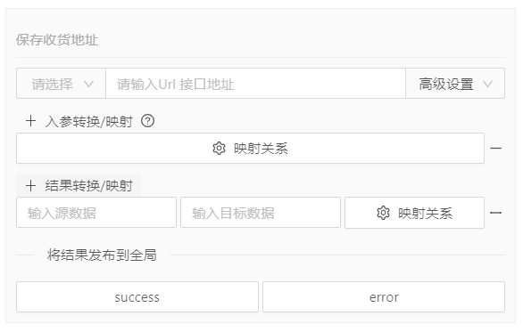
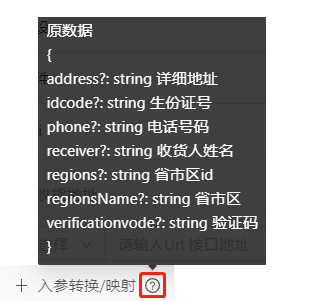
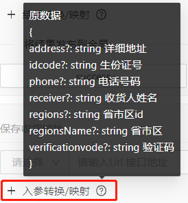

## Api

### Api分类
  #### api可在分为两类Api，一是预置数据，二是组件Api
  - 第一类：预置数据，要预先为应用准备数据（比如我要为抽奖项目预先准备奖品数据），那么请在 ***页面 > 页面设置 > 初始化Api*** 中配置您的api
    
  
  - 第二类：与组件强关联的内部运行事件处理Api（比如抽奖组件点击抽奖的api），请选择   ***组件 > 设置 > Api*** 进行配置
    


### Api配置
  无论是页面还是组件，同时有设置API **请求方法** 和 **url地址** 时，API才能在事件流中被调用。
  
  - 请求头
    <br/>
    请求行由请求方法、URL地址、高级设置组成
    1. 请求方法：GET、POST、DELETE、PUT
    2. URL地址，设置当前请求的Url
    3. 高级设置，高级设置可以配置当前请求头部信息：mode、headers、credentials
   <br/><br/>
  - 入参设置 <br />
    主动传参时，参考参数配置<br />
    <br />
    被动接受参数时可以通过 **入参转换/映射** 将上被动接受的原数据转换为Api所需要的参数，具体参考数据映射转换<br />
    <br />
  - 结果转换/映射 <br />
    结果转换/映射是将Api返回数据转换为所需要的数据，当Api返回数据结构与模块所需要的数据结构不一致时，可以通过字段映射用来调整成满足组件使用的数据结构，（这里仅做名称的调整，数据结构与要求相差太大时尽量调整Api）具体参考数据映射转换<br />
    <br />
  - 数据映射转换<br />
    数据映射转换是将旧数据转换为一个新的数据<br />
    
    <br />

    Eg：比如我们要将旧数据中的是user转换为memberInfo新数据中的memberInfo

    旧数据<br />
      ```json
        {
          "response": {
            "userInfo": {
              "name": "eightfeet",
              "age": ...
            }
          },
        }

      ```

    新数据<br />
      ```json
        {
          "response": {
            "userInfo": {
              "name": "eightfeet",
              "age": ...
            }
          },
          "memberInfo": {
            "firstName": "eightfeet",
            "age": ...
          }
        }
      ```