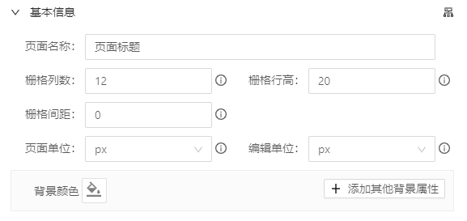

## 页面

为了呈现所见即所得的编辑，yugong将页面独立处理，访问项目可以通过页面+模板id （如：http://localhost:3000/?tpl=12  ）访问,而在编辑模式下这个链接同样是由一个iframe引入到编辑器中，**页面数据与编辑器数据完全隔离，内外通过postmessage安全通信**，通过message约定来同步编辑器与页面的数据，达到真正意义上的所见即所得；

具体流程：
1. 获取url模板id参数
2. 如果没有模板参数则读取本地缓存模板数据，或创建新页面
3. postmessage发布模板数据信息
4. 准备页面数据 解析页面数据，（页面配置与组件数据）
5. 初始化[页面配置](#页面配置)
6. 渲染页面与组件

---

### 页面配置
页面配置用于配置项目的通用环境和公共功能部分的始化数据配置。

进入编辑器从顶部菜单中点击“页面”按钮即可打开页面编辑面板

+ 基本信息
  > 基本信息包含页面标题、栅格数据、单位与背景样式

    

    - **页面名称** 
        
        用于设置页面的标题，这里可以通过脚本规则在页面运行时中获取或计算。

    - **栅格列数、栅格行高、栅格间距**

        页面栅格的列数，这里决定页面的编辑粒度，yugong编辑器是基于[react-grid-layout](https://github.com/react-grid-layout/react-grid-layout)来进行拖拽编辑的，遵循栅格布局标准；当栅格列数越大，栅格行高越小，可编辑的粒度也就越大，当然根据实际需求来定义
        
        > 栅格间距通常不建议设置，但有必要时也可以通过栅格间距来设置栅格之间的间隙，相对定位下栅格间隙内是不能存放内容的；
        
        这里也可以通过脚本规则在页面运行时中获取或计算

### 全局方法

