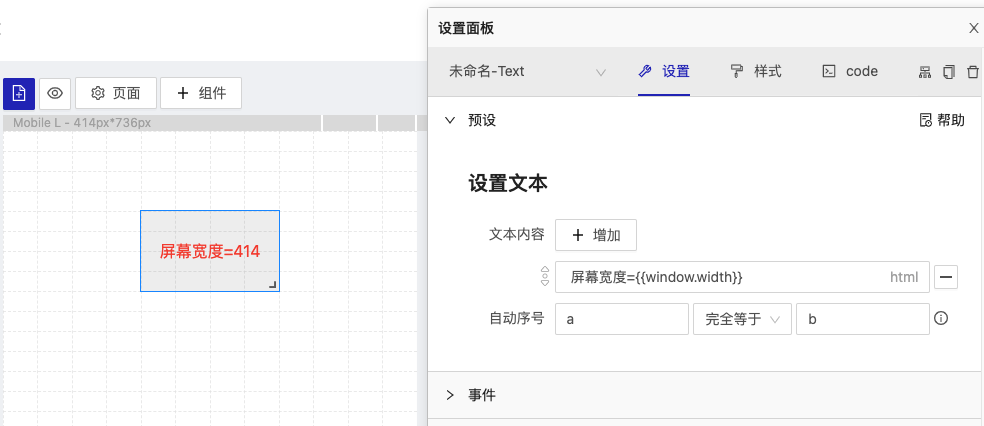
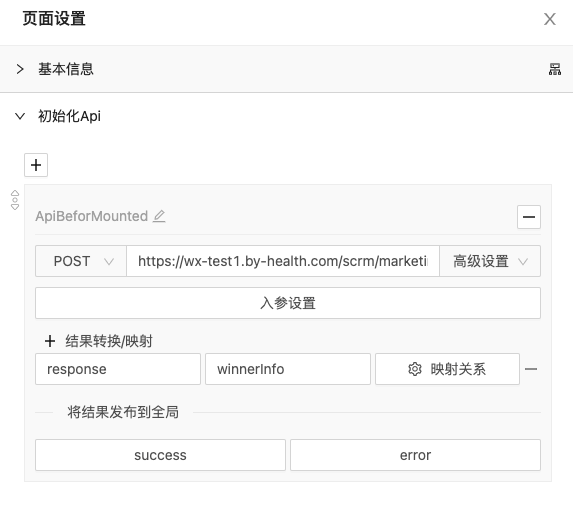
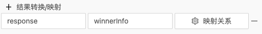

## 语法与规则
  - [运行时](#运行时)
  - [html语法标签](#html语法标签)
  - [{{}}取数规则](#取数规则)
  - [js{{}}表达式规则](#js表达式规则)
  - [Api中的脚本规则应用](#api中的脚本规则应用)
  
### 运行时

运行时是app运行时的数据池,是一份全局数据,供运行环境任何可以引用的地方使用;

在页面面板右上角、设置面版右上角的、参数面板的左上角都能看到图标  点击即可以打开运行时面板:


运行时默认包含下面数据

+ search
  
  url上的search参数数据,比如页面url `http://xxx?prame1=1&prame2=2` 那么search的数据就如下

  ```json
    {
        "prame1": "1",
        "prame2": "2"
    }
  ```

+ windowSize
+ unit

### html语法标签

为了得到更为灵活的展现形式,在yugong中参数设置部分条目允许使用html标签;

**编辑条目末尾有`html`标示时说明当前条目支持`html`标签:** 


### {{}}取数规则

设置面板中`{{}}`用于在运行时中获取数据,当我们把故意设定的参数发布到运行时后,即可通过`{{}}`来获取运行时的数据;

比如`runningTimes`中有默认`window`的`width`值.

```javascript
    {
        "search": {...},
        "window": {
            "height": 736,
            "width": 414
        },
        "unit": {...}
    }
```

我们可以通过如下方式来获取:



> 这里要注意,`{{}}`的root数据之乡的是runningTimes,所以在写`屏幕宽度={{window.width}}`不用写成`{{runningTimes.window.width}}`,而且`{{}}`的取数规则也仅能取到runningTimes下的数据,

### js{{}}表达式规则 

js 表达式规则是通过[safer-eval](https://github.com/commenthol/safer-eval#readme)来实现的，为了安全起见，运行上下文context仅仅包含了`{runningTimes, dayjs, data(Api提供的数据，仅在接口请求时存在)}`,用于处理简单的目运算，或其他数据的格式化等,比如用`dayjs`去格式化一个时间,也可以`js{{runningTimes.window.width <= 767 ? '移动设备' : '非移动设备'}}`


在`js{{}}`中,我们知道 
```javascript
  {
    runningTimes: {}, // 运行时数据,
    dayjs: {}, // 日期工具
    data: {} // data指的是舍呢???
  }
  
```
那么`data`指的是什么数据呢?

通常来说,data指的是最近的数据源,比如在一般设置数据时,data其实指的就是`runningTimes`,但在接口返回数据加工时它指向的就是接口的数据  `data = {response: api.response}`


### Api中的脚本规则应用

在Api中`{{}}`取数规则取的不再是`runningTimes`,他的数据源指向的是`Api.response`

`js{{}}`表达式中的运行上下文context包含数据,

```javascript
  {
    runningTimes: {}, // 运行时数据,
    dayjs: {}, // 日期工具
    data: {
      response: Api.response
    }
  }
  
```

在Api设置中`data`**是接口返回的上下文**,我们可以通过`{{}}`,`js{{data.response}}`或者`js{{this.response}}`来获取接口返回的数据;

下面以滚动播报的例子进一步说明Api配置中的数据规则


我们在页面初始化时为滚动播报组件准备数据，页面>初始化Api面板中准备好接口与参数，



这样就获得了需要轮播的数据，但此时我们查看下滚动播报组件的帮助文档知道支持的数据格式为

```
  [
      { "message": "第一条消息", ...},
      { "message": "第二条消息", ...},
      ...
  ]
```

而Api返回的数据格式为

```
  [
    {
      "memberName": "会员名",
      "prizeName": "奖品名"
    }
  ]

```

那么如何得到要求的数据:

  ```
    [
      {
        "message": "恭喜[会员名]获得[奖品名]",
        ...
      }
      ...
    ]
  ```
步骤

1. 完成Api数据请求后在Api设置面板上点击`+结果转换/映射`新增一条映射规则，通过映射规则程序遍历数组，将数组的每一项按映射规则转换：
   
   

   点击映射关系建立数据转换关系，输入新增属性`message`点击`+确定`,
   
   按照就近数据规则`{{}}`标签的数据源是数组的一个项`{memberName: 'xxx', prizeName: 'xxx'}`，`js{{}}`标签的数据源是`{runningTimes:{}, data:{memberName: 'xxx', prizeName: 'xxx'}, dayjs:{}}`
   
   在message栏输入我们的脚本规则

   ```
    恭喜会员js{{data.memberName.slice(0,1)}}** 抽中 {{prizeName}}
   ```

   上面规则翻译成脚本即是

   ```javascript
    '恭喜会员' + data.memberName.slice(0,1) + '** 抽中 ' + data.prizeName
   ```

   

   点击确定后，上下文`data`的数据将从`data.responst`里map出一个`winnerInfo`出来

   ```javascript
    data = {
      responst: {}, // Api返回的数据
      winnerInfo: {} // 经过映射转换的数据
    }
   ```

   `data`数据将会输送到下游;


2. 将数据发布到运行时
   
   将Api返回数据发布到runningTimes

   

   点击将结果发布到全局下的`success`按钮，

   

   点击新增字段，将`winnerInfo`发布到`runningTimes`;

   注意这里的脚本规则上下文就近原则data应该来自于Api与映射结果

   ```javascript
    data = {
      responst: {}, // Api返回的数据
      winnerInfo: {} // 经过映射转换的数据
    }
   ```

   所以
   
   `{{}}`指向的数据是`{responst, winnerInfo}`,
   
   `js{{}}`的上下文是`{runningTimes,data,dayjs}`;

   点击确定更新运行时这时在runningTimes里会有如下数据

   ```javascript
    runningTimes = {
      search: {},
      window: {},
      unit: {},
      winnerInfo: {}
    }
   ```

3. 将数据应用到组件，在组件的设置中将`winnerInfo`应用到数据中，配置好样式即可：


   


